# Estudo Testes de Unidade

## Referência: Testes automatizados na prática com Spring Boot
[Compre aqui](https://www.udemy.com/course/testes-automatizados-na-pratica-com-spring-boot/)
<hr>

## Dica para leitura:
Durante o estudo, os códigos mudam pois geralmente é ensinado algo básico onde depois iremos implementar o que de fato
é utilizado no mercado de trabalho. Tome cuidado ao considerar códigos do início do estudo, se atente ao código final.

## Tópicos
- [Proposta do Curso - Criando API Planetas](#criando-api-de-planetas)
- [Como saber se a API está funcionando? Cenários de Teste](#cenários-de-teste)
- [Cadastro de Usuário (espelhamento de pacotes)](#cadastro-de-um-usuário-com-sucesso)
- [Dublês de Teste](#dublês-de-teste)
  - [Dummy](#dummy-não-é-muito-usado-só-quando-não-queremos-criar-tudo-na-mesma-hora)
  - [Fake](#fake---para-banco-de-dados-em-memória-)
  - [Stub](#stub---cenário-mais-comum)
  - [Spy](#spy---um-stub-mais-robusto)
  - [Mock](#mock---geralmente-o-mais-utilizado)
- [Utilizando Mockito](#utilizando-mockito)
- [Trabalhando com Cenários de Erro](#trabalhando-com-cenários-de-erro)
- [Exercícios sobre Testes de Unidade](#exercícios)
  - [Exercício 1 - Consulta por ID](#exercício-1---testando-a-consulta-de-planeta-por-id)
  - [Exercício 2 - Consulta por Nome](#exercício-2---testando-a-consulta-de-planeta-por-nome)
  - [Exercício 3 - Consulta por Listagem](#exercício-3---testando-a-listagem-de-planetas)
  - [Exercício 4 - Testando a Remoçãod de Planetas por ID](#exercício-4---testando-a-remoção-de-planetas)
- [Resumo Sobre o Estudo](#resumo)
<hr>


Como vimos no estudo de introdução, testes de unidade seria para métodos ou classes, por exemplo.

Eles podem ser solitários e sociáveis.

- Solitários - É um teste que não interage com outras unidades. Uma classe calculadora,
por exemplo. O seu método de soma não depende de absolutamente nada. Quando falamos em depender,
estamos falando de banco de dados ou outros métodos externos.


- Sociável - É quando uma unidade conversa com outro método de código. Ou seja, quando há
alguma dependência no teste.
<hr>

## Criando API de Planetas

Aqui, criaremos um projeto spring padrão, e faremos a criação dos pacotes e classes. (Service,
Repositorie e Controller).

Padrão de sempre:

- Repositories: Guarda os métodos para serem criados. Dessa vez usaremos CrudRepository ao invés de JPA.

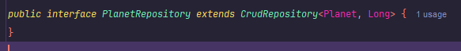
<hr>

- Service: Responsável pela criação, importa o repositorie.

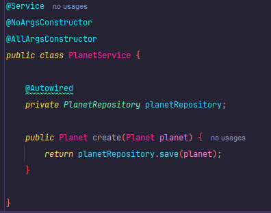
<hr>

- Controller: Responsável pelo retorno HTTP, importa o service.

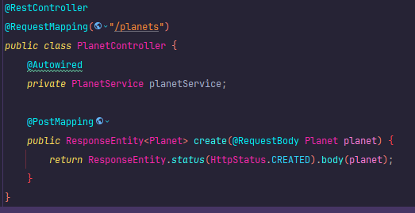

A partir do momento que rodarmos o código, as tables irão ser criadas dentro da Database starwars, veja:

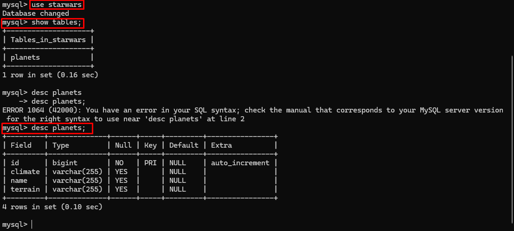

Para realizar um post dentro do powershell: 
>curl.exe --% -ku user:passwd http://localhost:8080/planets  -H "Content-Type: application/json" -d "{\"name\":\"name\", \"climate\":\"climate\",\"terrain\":\"terrain\"}" -v
<hr>

## Cenários de Teste
Como saber que a nossa aplicação funciona? Bom, primeiro precisamos definir quais comportamentos ela terá
em determinadas situações.

Uma boa é a gente definir os possíveis cenários, veja no diagrama:

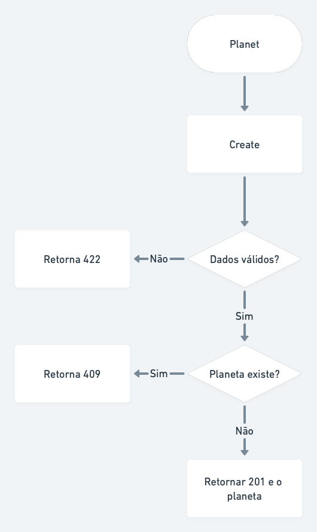
<hr>

## Cadastro de um usuário com sucesso

Primeiro. Vamos espelhar os nossos pacotes. Tudo que está dentro da API, vai para pasta de testes.

Como são testes unitários (de unidade), iremos considerar que tudo é uma classe (repository, service, controler...).

### Começaremos pela unidade que representa as regras de negocio, o **service**.

O nome da classe de teste será: ela + test ```public class PlanetServiceTest{}``` 

Sabemos que para realizar o teste, criaremos um metodo public void, veja:

1. Para nomear o método: operacao_estado_retornoEsperado
2. Importar o service e usar o @Autowired para ele ser instanciado pelo Spring.
3. Como a classe não tem um contexto spring, passamos @SpringBootTest. Ela irá montar o contexto 
da aplicação de teste e procurará por Beans que estão marcados no projeto principal e deixá-los disponíveis
para injeção.
Mas, como só queremos carregar uma unidade (service), nós podemos passar isso como parâmetro.

Dentro do método:

Uma estratégia válida para não ficar instanciando diversos planetas, é utilizar constrants.

Para isso, criaremos um pacote chamado: common. Nele, ficarão códigos comuns para teste.

Criaremos uma classe chamada PlanetConstrants:
```java
public class PlanetConstrants {
    public static final Planet PLANET = new Planet("name", "climate", "terrain");
}

```

Voltando para o método, importaremos de forma estática essa classe ```import static com.demo.swplanetapi.common.PlanetConstrants.PLANET;```

Criaremos uma variavel "sut" do tipo Planet, e instanciando-o. **SUT = system under test.**

E por fim, para testarmos e ver se o resultado é o que a gente espera, usamos o AssertJ.

Como é uma comparação de igualdade, importaremos o Apache na classe Planet para verificar a igualdade:
```java
    //clase Planet
    @Override
    public boolean equals(Object obj) {
        //primeiro parametro = objeto que estamos verificando se é igual.
        //segundo parametro = referenciando o proprio objeto (planet).
        return EqualsBuilder.reflectionEquals(obj, this);
    }
```

#### Código (ESSE CÓDIGO NO FIM DO ESTUDO MUDA POIS USAREMOS MOCKITO): 
```java
package com.demo.swplanetapi.domain;

import static com.demo.swplanetapi.common.PlanetConstrants.PLANET;
import org.junit.jupiter.api.Test;
import org.springframework.boot.test.context.SpringBootTest;
import static org.assertj.core.api.Assertions.assertThat;

@SpringBootTest(classes = PlanetService.class)
// passando o service.class para que o spring não instancie todos os Beans, somente esse.

public class PlanetServiceTest {
    private PlanetService planetService;

    @Test
    public void createPlanet_WithValidData_ReturnsPlanet() {
       Planet sut = planetService.create(PLANET);

       //planeta criado pelo service é igual ao que criei agora?
       assertThat(sut).isEqualTo(PLANET);

       // como esse metódo ^ trabalha com igualdade, não esquecer de implementar
        // o equals do apache na classe planet.
    }
}
```

Ao testar, esse código dará um erro. Ele não consegue encontrar uma definição de bean do PlanetRepository.

Isso acontece porque o PlanetService depende de um Repository. Quando testamos e instanciamos o Service, 
ele também tenta achar o Repository. 

#### Bom, como testar uma unidade de forma isolada, que possui dependência? Como manter esse teste solitário?
Usaremos **dublês de teste.**
<hr>

## Dublês de Teste
São usados pelos testes solitários para simular o comportamento das duas dependências. Existem vários
tipos de dublês, veja:

### Dummy (não é muito usado, só quando não queremos criar tudo na mesma hora)

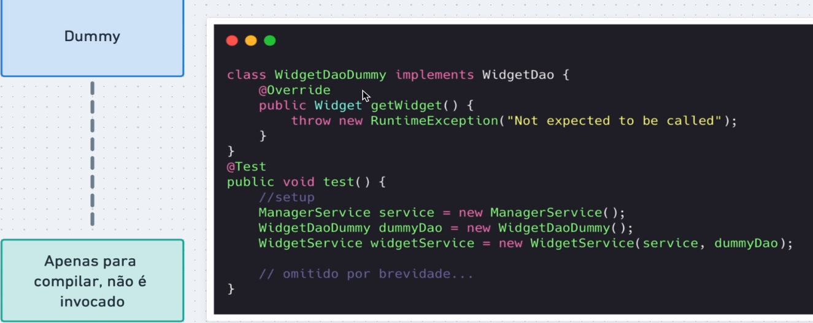

Implementamos um DAO (objeto de acesso ao banco de dados) numa classe Dummy. Esse tipo exige a implementação
de alguns métodos, então colocamos qualquer coisinha. Nesse caso foi o lançamento de uma exception.
<hr>

### Fake - Para banco de dados em memória. 

Implementação fake de um banco Oracle, por exemplo.

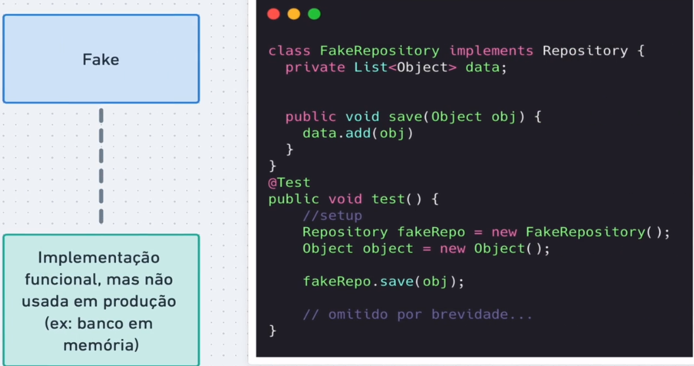

Nesse caso, usamos um Repository (ou um banco de dados) em lista (memória mesmo), para que seja possível
fazer o teste.
<hr>

### Stub - Cenário mais Comum

A ideia dele é responder com definição pré estabelecida.

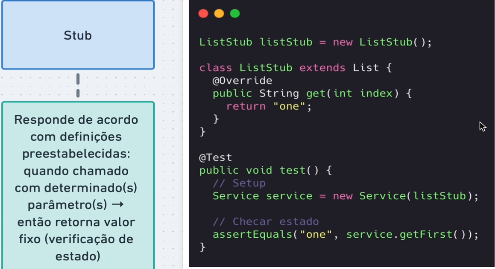

Nesse caso, temos uma lista. E quando o get é chamado pra obter o item da lista ele vai retornar
o mesmo valor.

Assim, é possível testar o service. Foi atribuito ao service a classe listSub (setup).

E depois checamos o estado.
<hr>

### Spy - Um stub mais robusto

Se comporta igual ao stub (fazendo implementação fitícia), mas além de definir o que será retornado,
o Spy coleta informação de como esses objetos do método foram invocados.

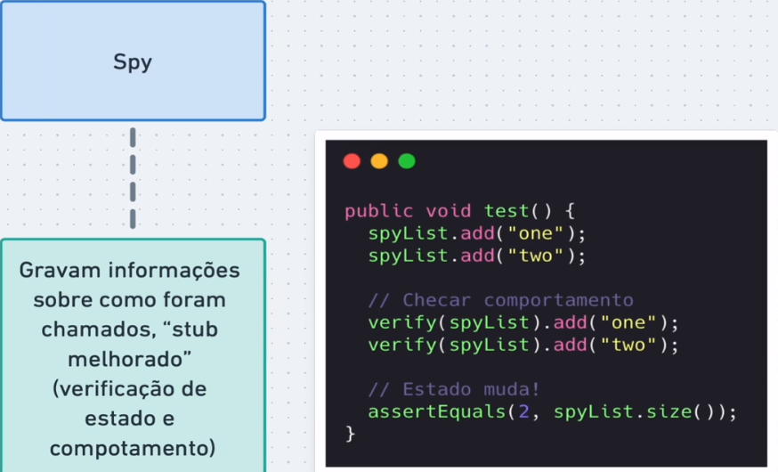

Verifica ali, por exemplo, se o método "add" foi chamado e quantas vezes. E é possivel verificamos
o comportamento que ocorreu quando chamamos o alvo de teste.

O estado da lista muda!
<hr>

### Mock - Geralmente o mais utilizado

Sua ideia é verificar o comportamento. Descreve a interação com a dependência, para ver se o fluxo
que a gente deseja foi invocado.

Então aqui a gente não verifica o estado final, e **sim o comportamento das chamadas durante o teste.**

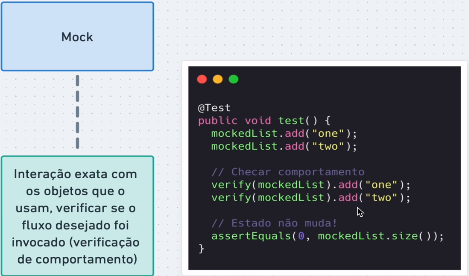

Diferente do Spy, aqui o estado da lista não muda. Só verifica se o método da classe foi chamado,
seja com determinados parâmetros ou quantas vezes.
<hr>

A boa notícia, é que não precisamos implementar esses métodos na mão. Quando trabalhamos com Spring,
utilizamos frameworks para fazer tudo isso (criar os dubles + as técnicas). E para isso, usaremos o:
**Mockito!**

Uso do Mockito com dublês de teste:


Aqui testamos um serviço de carro, que retornará os detalhes de um carro de acordo com o nome passado.

O legal é, nesse código, o service de carro, depende de um repository e o Mockito consegue mocar esse
repository. E não precisa criar um Stub na mão, e sim usar o when.

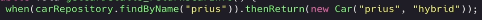

Ou seja: quando uma operação for chamada (when). Quando isso acontecer, dará o retorno (thenReturn).

Assim que chamarmos o carService, ele usará o when e depois o assert irá verificar a condição.
<hr>

## Utilizando Mockito

Como nosso Sring não consegue localizar o Repository do nosso service (conforme visto acima), **utilizaremos o
Mockito para criar esse dublê de teste do planet repository.**

### Como mockar essa dependência?
Importamos o PlanetRepository e passamos a anotação.
```java
@MockBean
private PlanetRepository planetRepository;
```

Bom, ao rodarmos nosso código, ele não dará erro. Mas nosso SUT será null. Isso acontece, porque mesmo importando
o repository, ele continua sendo um Mock. Um Mock não é uma implementação real do componente, não possuem lógica.

Então precisamos definir espectativas claras do que vai ser chamado e retornado. Então aqui usaremos o dublê do tipo
**Stub**, veja:
```java
//antes do sut ser iniciado
when(planetRepository.save(PLANET)).thenReturn(PLANET);
```

Ou seja, quando o planetRepository.save for chamado exatamente com aquele planeta específico ele retornará o planeta.

Isso que fizemos segue até um princípio dos testes, chamado AAA.
```java
    @Test
    public void createPlanet_WithValidData_ReturnsPlanet() {
        //AAA

        //ARRANGE - ARRUMA OS DADOS PRO TESTE
        when(planetRepository.save(PLANET)).thenReturn(PLANET);

        //ACT - FAZ A OPERAÇÃO DE FATO QUE QUEREMOS TESTAR
       Planet sut = planetService.create(PLANET);

       //planeta criado pelo service é igual ao que criei agora?

        //ASSERT - AFERE SE O SISTEMA SOB TESTE É O QUE ESPERAMOS.
       assertThat(sut).isEqualTo(PLANET);

       // como esse metódo ^ trabalha com igualdade, não esquecer de implementar
        // o equals do apache na classe planet.
    }
```

Pequena correção. Quando usamos a anotação do Springboot para iniciar o Service, acaba que ele cria muitos logs só
para injetar o service. Então a ideia é usarmos o Mockito, criando um teste de unidade puro! Veja como:
1. Tirar anotação @SpringBootTest e passar @ExtendWith(MockitoExtension.class);
2. Não injetaremos mais com @AutoWired nem @MockBean, porque não tem mais Spring. Substituiremos por:
   3. @InjectMocks no service. Essa anotação instancia o service (cria instancia real) e todas as dependências dele
   já são injetadas pelo Mock.
   No caso do service, ainda precisamos passar o @Mock (pois precisamos fazer o stub ainda).

Agora o teste será executado muito mais rápido que antes.
### CÓDIGO FINAL
```java
package com.demo.swplanetapi.domain;

import static com.demo.swplanetapi.common.PlanetConstrants.PLANET;
import org.junit.jupiter.api.Test;
import org.junit.jupiter.api.extension.ExtendWith;
import org.mockito.InjectMocks;
import org.mockito.Mock;
import org.mockito.junit.jupiter.MockitoExtension;
import static org.assertj.core.api.Assertions.assertThat;
import static org.mockito.Mockito.when;

@ExtendWith(MockitoExtension.class)
public class PlanetServiceTest {
    @InjectMocks
    private PlanetService planetService;
    @Mock
    private PlanetRepository planetRepository;
    @Test
    public void createPlanet_WithValidData_ReturnsPlanet() {
        //AAA
        //ARRANGE - ARRUMA OS DADOS PRO TESTE
        when(planetRepository.save(PLANET)).thenReturn(PLANET);

        //ACT - FAZ A OPERAÇÃO DE FATO QUE QUEREMOS TESTAR
       Planet sut = planetService.create(PLANET);

       //planeta criado pelo service é igual ao que criei agora?

        //ASSERT - AFERE SE O SISTEMA SOB TESTE É O QUE ESPERAMOS.
       assertThat(sut).isEqualTo(PLANET);

       // como esse metódo ^ trabalha com igualdade, não esquecer de implementar
        // o equals do apache na classe planet.
    }
}
```
<hr>

## Trabalhando com Cenários de Erro

Neste estudo específico, sabemos que teremos dois cenários possíveis para erro.

1. Quando não é informado os dados obrigatórios.
2. Quando tentamos criar um planeta que já existe.

Não seria muito bacana validar esses dados dentro do service com um monte de If. O ideal seria validar na camada de
Controladores, para quando receber o request ele já retornar o badrequest pro cliente. E por segurança, também colocar
essa validação no repository (a nivel de banco de dados).

Vamos validar o comportamento do repository (que o service chama), quando passamos dados não integros, veja:


**- Quando não é informado os dados obrigatórios.**
1. Criaremos um método createPlanet_WithInvalidData_ThrowsException;
2. Criaremos uma variável em PlanetConstraints chamada INVALID_PLANET e todas as suas variáveis serão vazias;
   3. Essa variável será importada de forma estática.
4. Quando criamos esse INVALID_PLANET, assim como na função lá de cima, ele vai depender do repository dentro do
service. E asssim como lá em cima, criaremos um stub, amarrando uma condição e uma resposta associada a ela e
retornaremos uma exception.
5. Ao invés de usarmos o AssertThat, usaremos assertThatThrownBy. Ele verifica se uma operação lançou uma exceção.
<hr>

**- Quando o planeta já existe.**

A ideia seria fazer igual falamos ali em cima. criar as limitações (constraints) no banco de dados, 
deixaremos ele criar a exceção (se um planeta já existir) e trataremos essa exceção no Controlador.

Mas esse teste que fizemos em cima, já atende essa condição de **planeta já existente**.
<hr>

## Exercícios
### Exercício 1 - Testando a consulta de planeta por ID.


[Método do Service](https://github.com/zenonxd/estudo-testes-unidade/blob/6529420adaf9a44df0feac882fe9fa7769aad4ad/src/main/java/com/demo/swplanetapi/domain/PlanetService.java#L22)
-
No método, fazer o retorno entrando no repository e usar findById.

[Método do Controller](https://github.com/zenonxd/estudo-testes-unidade/blob/6529420adaf9a44df0feac882fe9fa7769aad4ad/src/main/java/com/demo/swplanetapi/web/PlanetController.java#L25)
-
1. Passar o parâmetro no @GetMapping. 
2. Acessar o planetService e seu método getById;
3. Usar o .map parar dar o ".ok()" passando o planet ou ".notFound()".

### Na classe de teste 👇

[Retornando se existir o ID informado](https://github.com/zenonxd/estudo-testes-unidade/blob/6529420adaf9a44df0feac882fe9fa7769aad4ad/src/test/java/com/demo/swplanetapi/domain/PlanetServiceTest.java#L50)
-
```java
    @Test
    public void getPlanet_ByExistingId_ReturnsPlanet() {
        //PASSAR NO findById o parâmetro a ser testado, retornará o planeta.
        when(planetRepository.findById(1L)).thenReturn(Optional.of(PLANET));

        Optional<Planet> sut = planetService.get(1L);

        assertThat(sut).isNotEmpty();
        assertThat(sut.get()).isEqualTo(PLANET);
    }
```
<hr>

[Retornando se não existir o ID informado](https://github.com/zenonxd/estudo-testes-unidade/blob/6529420adaf9a44df0feac882fe9fa7769aad4ad/src/test/java/com/demo/swplanetapi/domain/PlanetServiceTest.java#L61)
-
```java
    @Test
    public void getPlanet_ByUnexistingId_ReturnsPlanet() {
        //testando uma id inexistente, retornará um optional empty.
        when(planetRepository.findById(1L)).thenReturn(Optional.empty());

        Optional<Planet> sut = planetService.get(1L);

        assertThat(sut).isEmpty();
    }
```
<hr>

### Exercício 2 - Testando a consulta de planeta por nome.


Mesma lógica de cima.

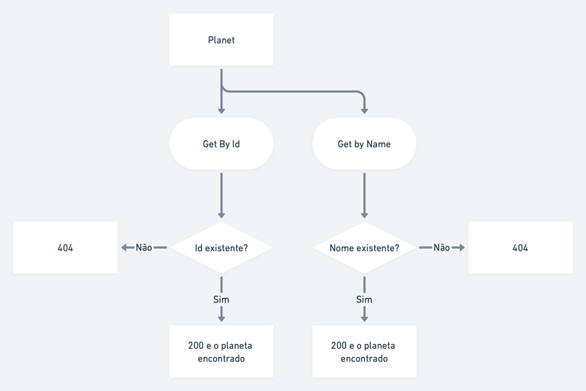

[Método do Service](https://github.com/zenonxd/estudo-testes-unidade/blob/6529420adaf9a44df0feac882fe9fa7769aad4ad/src/main/java/com/demo/swplanetapi/domain/PlanetService.java#L26)
-
Bem padrão usar o método findByName criado no repository.

[Método do Controller](https://github.com/zenonxd/estudo-testes-unidade/blob/6529420adaf9a44df0feac882fe9fa7769aad4ad/src/main/java/com/demo/swplanetapi/web/PlanetController.java#L31)
-

1. Passar o parâmetro no @GetMapping. 
2. Acessar o planetService e seu método getByName;
3. Usar o .map parar dar o ".ok()" passando o planet ou ".notFound()".

### Na classe de teste 👇

[Retornando se o name existir](https://github.com/zenonxd/estudo-testes-unidade/blob/6529420adaf9a44df0feac882fe9fa7769aad4ad/src/test/java/com/demo/swplanetapi/domain/PlanetServiceTest.java#L70)
-
```java
    @Test
    public void getPlanet_ByExistingName_ReturnsPlanet() {
        when(planetRepository.findByName(PLANET.getName())).thenReturn(Optional.of(PLANET));

        Optional<Planet> sut = planetService.getByName(PLANET.getName());

        assertThat(sut).isNotEmpty();
        assertThat(sut.get()).isEqualTo(PLANET);
    }
```
<hr>

[Retornando se o name não existir](https://github.com/zenonxd/estudo-testes-unidade/blob/6529420adaf9a44df0feac882fe9fa7769aad4ad/src/test/java/com/demo/swplanetapi/domain/PlanetServiceTest.java#L80)
-
```java
    @Test
    public void getPlanet_ByUnexistingName_ReturnsPlanet() {
        final String name = "Unexisting name";
        when(planetRepository.findByName(name)).thenReturn(Optional.empty());

        Optional<Planet> sut = planetService.getByName(name);

        assertThat(sut).isEmpty();
    }
```
<hr>

### Exercício 3 - Testando a listagem de planetas.


Uma proposta um pouco diferente dos dois exercícios acima.

[Método do Repository](https://github.com/zenonxd/estudo-testes-unidade/blob/6529420adaf9a44df0feac882fe9fa7769aad4ad/src/main/java/com/demo/swplanetapi/domain/PlanetRepository.java#L14)
-
No repository, precisamos criar esse findAll do Service. Para usar esse findAll precisa expor através de outra interface
(QueryByExampleExecutor<Planet>).

Essa interface permite criar consultas com o objeto example, que cria uma query dinâmica. Assim que implementar, ele vai
para o findAll e vai conseguir implementar a lógica.

[Método do Service](https://github.com/zenonxd/estudo-testes-unidade/blob/6529420adaf9a44df0feac882fe9fa7769aad4ad/src/main/java/com/demo/swplanetapi/domain/PlanetService.java#L30)
-
Para tornar essa solução mais versátil no que se diz respeito a pesquisa, usamos Example API. É interessante para
criarmos querys dinâmicas. Essa query no caso é baseada na entidade Planet, para fazer isso:
1. Criamos uma classe [QueryBuilder](https://github.com/zenonxd/estudo-testes-unidade/blob/main/src/main/java/com/demo/swplanetapi/domain/QueryBuilder.java);
2. Nela, verificaremos o que a gente informou. O que for nulo, iremos ignorar (como filtro).

Exemplo, se no planet não for informado nem o climate, nem o terrain não teremos filtro nenhum, estará tudo nulo e ele
vai buscar todo mundo!

Agora, se informamos um deles, ele considera o valor preenchido e colocará como filtro na query.

Isso é muito válido para não precisar criar um método para cada tipo de filtro e depois fazer "if's" para ver qual chamar.

Voltando para o método Service:
1. Criamos a query dinâmica;
2. E fazemos a consulta por todos os planetas que atendem as especificações dessa query.


[Método do Controller](https://github.com/zenonxd/estudo-testes-unidade/blob/6529420adaf9a44df0feac882fe9fa7769aad4ad/src/main/java/com/demo/swplanetapi/web/PlanetController.java#L37)
-

Aqui teremos uma proposta diferente dos outros métodos. Nosso GET receberá um parâmetro maior (url) e o retorno será
diferente.

1. Ao invés de ``ResponseEntity<Planet>`` será ``ResponsiveEntity<List<Planet<>``;
2. Ao invés de passar ``@PathVariable``, passaremos ``@RequestParam``, required falso e o String terrain e climate;
3. Criaremos uma Lista e atribuiremos a letra o ``planetService.list(terrain, climate)``, passando os dois parâmetros;

   - lembrar que esse .list é o metodo que recebe a query e instancia o new Planet.
4. Retornaremos o .ok(planets) < lista.

### Na classe de teste 👇

[Retornando Lista de Planetas](https://github.com/zenonxd/estudo-testes-integracao/blob/452bbf8c71d25d54b0610229e6c4c28bd811ded4/src/test/java/com/demo/swplanetapi/domain/PlanetServiceTest.java#L95)
-
```java
    @Test
    public void listPlanets_ReturnsAllPlanets() {
        List<Planet> planets = new ArrayList<>(){{
            add(PLANET);
        }};

        //query selicionada, nesse caso usaremos os dois parâmetros
        Example<Planet> query = QueryBuilder.makeQuery(new Planet(PLANET.getClimate(), PLANET.getTerrain()));

        //quando o repositorio chamar o findAll com essa query, ele irá
        // retornar a lista
        when(planetRepository.findAll(query)).thenReturn(planets);

        List<Planet> sut = planetService.list(PLANET.getTerrain(), PLANET.getClimate());

        assertThat(sut).isNotEmpty();
        assertThat(sut).hasSize(1);
        assertThat(sut.get(0)).isEqualTo(PLANET);
    }
```
<hr>

[Retornando Nenhum Planeta](https://github.com/zenonxd/estudo-testes-integracao/blob/452bbf8c71d25d54b0610229e6c4c28bd811ded4/src/test/java/com/demo/swplanetapi/domain/PlanetServiceTest.java#L114)
-
```java
    @Test
    public void listPlanets_ReturnsNoPlanets() {

        //importando esse any() estático para não ser preciso iniciar uma query
        when(planetRepository.findAll(any())).thenReturn(Collections.emptyList());

        //quando iniciamos esse service, ele vai se encaixar na condição do any 
        // acima pois ele vai aceitar qualquer parametro para retornar a coleção 
        // vazia
        List<Planet> sut = planetService.list(PLANET.getTerrain(), PLANET.getClimate());

        assertThat(sut).isEmpty();
    }
```


<hr>

### Exercício 4 - Testando a remoção de planetas.

Vamos remover um planeta baseado na sua ID.


Método do Repository
-
Não será implementado nada, pois o deleteById já é existente nele.


[Método do Service](https://github.com/zenonxd/estudo-testes-integracao/blob/452bbf8c71d25d54b0610229e6c4c28bd811ded4/src/main/java/com/demo/swplanetapi/domain/PlanetService.java#L35)
-
Uma função void somente deletando o planeta pelo ID.

[Método do Controller](https://github.com/zenonxd/estudo-testes-integracao/blob/452bbf8c71d25d54b0610229e6c4c28bd811ded4/src/main/java/com/demo/swplanetapi/web/PlanetController.java#L44)
-
Uma função void onde irá remover o id através do service e depois retornar o ResponsiveEntity com noContent e build.

### Na classe de teste 👇

Como os métodos nas classes acima são void (não retornam nada), os nossos métodos de teste precisam somente verificar
se alguma exceção foi lançada.

A única diferença é que não podemos usar o ``when`` primeiro dessa vez. Quando usamos o when, ele recebe um repository
que retorna algo. Ele precisa retornar um void dessa vez.

Então usamos o assertThatCode e doThrow (informando primeiro qual exceção será lançada e depois a condição.

[Removendo Planeta com ID Existente](https://github.com/zenonxd/estudo-testes-integracao/blob/452bbf8c71d25d54b0610229e6c4c28bd811ded4/src/test/java/com/demo/swplanetapi/domain/PlanetServiceTest.java#L127)
-
```java
    @Test
    public void removePlanet_WithExistingId_doestNotThrowAnyException() {
        //faz o assert de que essa função (.remove), não lançará nenhuma exceção.
        assertThatCode(() -> planetService.remove(1L)).doesNotThrowAnyException();
    }
```
<hr>

[Removendo Planeta com ID não Existente + Exceção](https://github.com/zenonxd/estudo-testes-integracao/blob/452bbf8c71d25d54b0610229e6c4c28bd811ded4/src/test/java/com/demo/swplanetapi/domain/PlanetServiceTest.java#L132)
-
```java
    @Test
    public void removePlanet_WithInvalidId_ThrowsException() {
        //passando do throw, especificando a exceção primeiro e depois a condição,
        //pois estamos trabalhando com retorno void.
        doThrow(new RuntimeException()).when(planetRepository).deleteById(99L);

        //aqui verificamos se, ao passar o remove, usando a mesma ID de cima, é
        //lançada uma exceção de RunTimeException.
        assertThatThrownBy(() -> planetService.remove(99L)).isInstanceOf(RuntimeException.class);
    }
```

<hr>

## RESUMO

### TEORIA
1. Sempre definir cenários de teste, imaginando os possíveis comportamentos da aplicação;
2. Quando formos realizar o teste, sempre espelhar as camadas. Ou seja, o pacote de test, também terá domain,
web, controller, etc;
3. Para não instanciar toda hora, um objeto, criamos uma [Constrant](https://github.com/zenonxd/estudo-testes-integracao/blob/main/src/test/java/com/demo/swplanetapi/common/PlanetConstrants.java), 
onde terá o objeto instanciado com os parâmetros
desejados. Ela será importada para a classe de teste de forma estática;
4. Dentro de quase todo método de teste, será criada essa constraint com o nome SUT, para instanciar os objetos;
5. Na classe do Domain, ter o método equals implementado, pois o assertJ fará comparação de igualdade;
6. Lembrar de [tipos de dublês de teste](#dublês-de-teste);
7. [Mockar as dependências](#como-mockar-essa-dependência);
<HR>

### PRATICA
1. Lembrar sempre: O que iremos testar, precisa mexer algo no repository?
2. Depois, implementar o método no service. Nele, faremos as regras de negócio, utilizando métodos do repository;
3. No Controller, realizar as requisições.
4. Na classe de teste, lembrar do AAA;
    - Arrange - Arrumar os dados para teste;
      - (o when do mockito).
    - Act - Fazer a operação de fato que queremos testar;
      - instanciação do sut/constraint.
    - Assert - Afere se o sistema sob teste é o que esperamos.
      - comparação com o AssertJ.
5. Caso nosso método de teste tenha retorno void, o desenvolvimento de código será mais enxuto, verificando somente
se retornará ou não uma exception.
<hr>

## Fim
E aqui finalizamos os cenários de erro a nivel de serviço. Mas... não temos a garantia ainda de que o sistema está
tratando dados invalidos. De fato isso é verdade, a gente precisa testar as camadas que fazem essa validação,
Controller e Repositories.

Mas essas camadas possuem integração (controller com web) e (repositorie com banco de dados). Por isso agora,
utilizaremos [Testes de Integração](https://github.com/zenonxd/estudo-testes-integracao).
